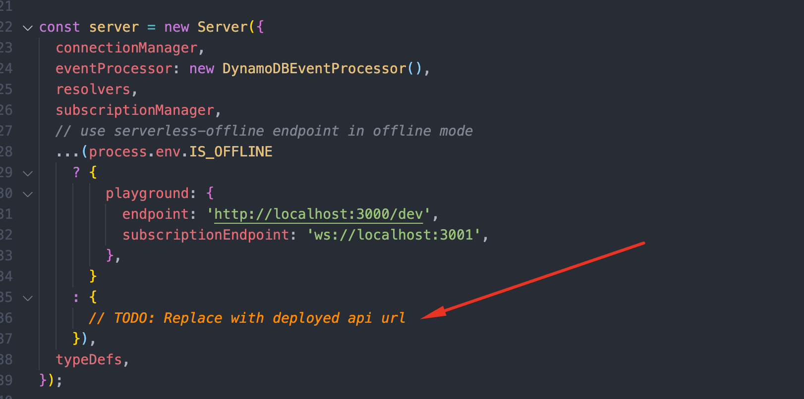

# Superformula Cloud Backend Test

## About

### What am I building here?

Build a GraphQL API for User management.

Detailed requirements can be found in [here](./REQUIREMENTS.md)

### DEMO

Here is the [demo playground](https://1tms7d8k7d.execute-api.us-east-2.amazonaws.com/dev) that I have deployed.
You can find graphql queries/mutations/subscriptions to play around from [here](./docs/playground.graphql).

### Tools

- Typescript
- Node
- Serverless
- Yarn
- [Lerna](https://lerna.js.org/)
- Jest
- [Graphql Codegen](https://www.graphql-code-generator.com/)
- AWS API Gateway v1 & v2
- AWS Lambda
- AWS DynamoDB
- AWS DynamoDB Stream
- Terraform
- ESLint
- Prettier
- Commitlint

### Project structure

Project heavily depends on [aws-lambda-graphql](https://github.com/michalkvasnicak/aws-lambda-graphql#readme) in the architectural perspective.

[Cloud Architecture](https://github.com/michalkvasnicak/aws-lambda-graphql#infrastructure)

- [packages/api](packages/api) - `Node`/`Graphql`/`Serverless`/`Typescript` application and deployment scripts with `Terraform`
- [packages/app](packages/app) - `React`/`Typescript` frontend application created by [create-react-app](https://create-react-app.dev/docs/adding-typescript/#installation)
- [packages/core](packages/core) - shared library code between `api` and `app`

## Local Development

### Local Development Prerequisites

- [ ] Node.js environment (v12.x or above is preferred)
- [ ] Mapbox account and access_token. [Mapbox](https://mapbox.com)

### Setup

- **Clone the repo**
- **Install dependencies**

  ```bash
  yarn install
  ```

- **Install dynamodb**

  ```bash
  yarn install:dynamodb
  ```

  | ***NOTE***
  Please refer to the following documents if you have any issues installing dynamodb.
  [AWS Guide](https://www.npmjs.com/package/serverless-dynamodb-local)
  [Serverless Dynamodb Local](https://www.npmjs.com/package/serverless-dynamodb-local)

- **Add environment variables for local development**
  - Create `environment` folder under [packages/api/](packages/api).
  - Create `dev.js` under the `environment` folder.
  - Add `MAP_BOX_ACCESS_TOKEN` into `dev.js`.

    ```js
    module.exports = {
      MAP_BOX_ACCESS_TOKEN: 'COPY YOUR MAP_BOX_ACCESS_TOKEN HERE',
    };
    ```

- **Start offline server**

  ```bash
  yarn start:api
  ```

  This will start the offline server:
  - Offline server starts the local dynamodb instance and `Users` Table will be seeded with the data in this [json](packages/api/seed/Users.json).
  - Offline server exposes 2 endpoints:
    - Http endpoint which will handle `Queries` and `Mutations`.
    - Websocket endpoint which will handle websocket connections for  `Subscriptions`.
  - You will be able to visit the playground at [here](http://localhost:3000/dev).

- **Run Unit test**

  ```bash
  yarn test
  ```

### Further development

- Manage graphql schemas and resolvers
  
  Add/update schemas/resolvers at [packages/api/src/schemas](packages/api/src/schemas).

  After you updated the `*.graphql` file which contains schema, you need to run `yarn generate` to sync the typings with the schema.

- Manage database models and logic

  Add/Update db related functions at [packages/api/src/services](packages/api/src/services).

- Manage subscriptions with `pubSub`

  Add/Update pubSub related constants/functions at [packages/api/src/subscriptions](packages/api/src/subscriptions).

- Manage common utility functions

  Add/Update commonly used constants/functions at [packages/api/src/utils](packages/api/src/utils).

- Unit Tests

  You can add unit tests under `__test__` folder and run test with `yarn test`.

## API Deployment

### API Deployment Prerequisites

- [ ] [Terraform](https://learn.hashicorp.com/tutorials/terraform/install-cli)
- [ ] AWS account and [aws-cli](https://docs.aws.amazon.com/cli/latest/userguide/install-cliv2.html)
- [ ] Configure AWS for deployment. [Guide](https://docs.aws.amazon.com/cli/latest/userguide/cli-chap-configure.html)

### Initial Setup

- **Add environment variables for local development**
  - Create `environment` folder under [packages/api/terraform/](packages/api/terraform).
  - Create `dev.tfvars` under the `environment` folder.
  - Configure deployment configurations. i.e.

    ```terraform
    aws_region          = "us-east-2"
    s3_bucket           = "S3_BUCKET_NAME TO KEEP TERRAFORM STATE"
    mapbox_access_token = "COPY YOUR MAP_BOX_ACCESS_TOKEN HERE"
    ```

- Init Terraform

  ```bash
  cd packages/api/terraform
  terraform init
  ```

- Build api

  ```bash
  yarn build:api
  ```

- Deploy api

  ```bash
  yarn deploy:api
  ```

  | *NOTE* Before you deploy, if you would like to check what kind of resources will be deployed to your AWS account, you can run `terraform plan`.

  ```bash
  cd packages/api/terraform
  terraform plan --var-file=./environment/dev.tfvars
  ```

- Seed test data to AWS Dynamodb (*Optional*)

  ```bash
  yarn seed:data
  ```

  This will put 25 users into the `Users` Table of deployed DynamoDB for testing purpose.

  | *NOTE* Please make sure that the `aws_region` configured with your `aws-cli` and `dev.tfvars` are same.

- Check deployed playground

  `yarn deploy:api` script will print out the `https` and `websocket` API Gateway endpoint url that has been deployed.

  | *NOTE* To enjoy the full graphql playground experiences with subscriptions, please follow the next step:
  - You can update `playground` configurations in the `api` source code and redeploy endpoint.
  

  ```js
  {
    playground: {
      endpoint: 'https://...',
      subscriptionEndpoint: 'wss://...',
    },
  }
  ```

### Further deployment

You can just repeat `build/deploy` api.

- Build api

  ```bash
  yarn build:api
  ```

- Deploy api

  ```bash
  yarn deploy:api
  ```

  | *NOTE* Before you deploy, if you would like to check what kind of resources will be deployed to your AWS account, you can run `terraform plan`.

  ```bash
  cd packages/api/terraform
  terraform plan --var-file=./environment/dev.tfvars
  ```

### Commands

- `yarn generate` Generates typings from graphql schema
- `yarn install:dynamodb` Installs dynamodb local server
- `yarn start:api` Starts local api server with serverless
- `yarn test` Runs unit tests
- `yarn start:app` Starts local React application
- `yarn build:api` Bundles api
- `yarn deploy:api` Deploys api with terraform
- `yarn destry:api` Destroys deployed api with terraform
- `yarn seed:data` Seed the deployed DynamoDB `Users` Table
- `yarn lint` Runs eslint

## Improvements

### Client API generation

We can extends the usage of [Graphql Code Generator](https://www.graphql-code-generator.com/) with graphql documents that can be used from the frontend.

This would be the similar to [this](docs/playground.graphql) but can add some variable configurations.

### Integration tests

We can use serverless testing framework for integration tests. [Doc](https://www.serverless.com/framework/docs/guides/testing)

### E2E tests

I can configure `Cypress` after the frontend repo is done and we can run it in the CI/CD pipeline for `main development` branch or `PR`.

## CI/CD pipeline setup

Configure CI/CD pipeline which runs the followings for `Pull Requests`:

- Lint
- Unit test
- Build

Configure CI/CD pipeline which runs the followings for stage branches(i.e. dev):

- Lint
- Unit test
- Integration test
- E2E test
- Build
- Deploy

### Technical Debts

- Scaling issue
  I have challenged to implement solutions without AppSync and use [aws-lambda-graphql](https://github.com/michalkvasnicak/aws-lambda-graphql#readme) for Grahpql Engine.
  The problem I am seeing here is that when we are going to scale things, we will face some issues with scaling and the size of lambda.
  AppSync provides flexible scalability by keeping resolvers in different lambda functions rather than keeping them in one lambda.
  [Issue](https://github.com/michalkvasnicak/aws-lambda-graphql/issues/143)

- Dynamodb Pricing
  I have used dynamodb stream and while looking into the codebase, it seems like it has some cost issues with large applications. Maybe can try with other solutions like Redis, etc.
  [Issue](https://github.com/michalkvasnicak/aws-lambda-graphql/issues/72)

#### Conclusion

- For now, I think it would be worth using AppSync for more stable and scaling app development which is scaling great although it has some [limitations](https://docs.aws.amazon.com/general/latest/gr/appsync.html).
