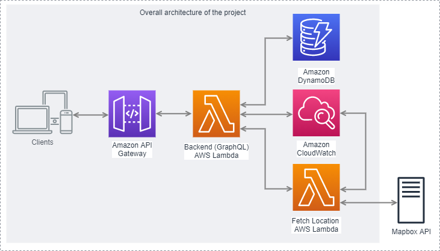
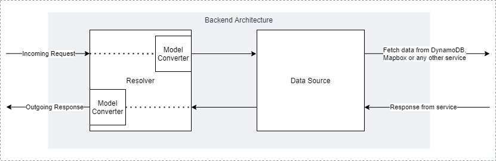

# Superformula Cloud Backend Test - Bruno Rodrigues

## Tech stack

To implement this solution for the Superformula Cloud Backend Test, the following tech stack was used:

- [**Node.js**](https://nodejs.org/en/) as runtime;
- [**Typescript**](https://www.typescriptlang.org/) as programming language;
- [**API Gateway**](https://aws.amazon.com/api-gateway/) to expose our APIs, with **AWS Lambda** to process the requests;
- [**GraphQL**](https://graphql.org/) as the way of exposing and consuming data from our APIs (used with Apollo Server for lambdas);
- [**DynamoDB**](https://aws.amazon.com/dynamodb/) as database;
- [**Terraform**](https://www.terraform.io/) as IaC tool;

## The architecture of the solution

As it is possible to see in the image below, the overall architecture is composed of an API Gateway, an AWS Lambda for our backend, DynamoDB, CloudWatch, and another AWS Lambda to fetch locations from Mapbox API. Their roles are as follows:

- The **API Gateway** takes care of exposing our APIs to the world, and, when it receives requests, it takes care of properly directing them to our Backend Lambda. It is worth mentioning that this combination (API Gateway + AWS Lambda) is really powerful when it comes to building APIs since it is scalable **by design**: if one or one million users reach the API Gateway, it can instantiate as many AWS Lambdas as needed to handle all the requests;
- The **Backend Lambda** is the core component of this solution. Its job is to process the requests, fetch data from services, such as DynamoDB, manipulate the received data and return it the way it was requested (that's when GraphQL comes into action). To make it work, **Backend Lambda** uses, at the top level, [apollo-server-lambda](https://www.npmjs.com/package/apollo-server-lambda), which is the one who deals with GraphQL, either when receiving a request and directing it to a resolver, or when selecting what will be returned as a response;
- **DynamoDB** is the one in charge of persisting and storing data, and it manages to do it with a focus on performance and scalability. In this solution, all information about users is at DynamoDB's hands; therefore, every time someone reaches the backend with the intention of fetching or manipulating user info, Backend Lambda then goes to DynamoDB to do so;
- **Fetch Location Lambda**, is responsible for getting the coordinates of an address from Mapbox API. When Backend Lambda receives a query for location, it then contacts **Fetch Location Lambda**, which in turn sends the address input to Mapbox, and then returns the 5 locations that best fit the given input;
- **CloudWatch**'s purpose in this solution is very simple: to manage the logs created by our AWS Lambdas.

### The internal architecture of **Backend Lambda**

As it is possible to notice below, the architecture of the Backend Lambda is fairly simple.

After receiving from Apollo Server a request to be processed, the resolvers need to pass the input to the data sources, but before that, they call a model converter (e.g. UserModelConverter) to transform the input into a format that the data sources can understand. Even though most of the time the outputs of model converters are almost identical to the inputs, this step is important because it decouples the API models from data source models, avoiding cases such as the API breaking because a database model changed, or vice versa.

When a data source gets the transformed input, it can fetch or manipulate data from DynamoDB, for example, or it can also call Fetch Location Lambda to get location information from Mapbox. After obtaining the response from any of these services, the data source validates and processes it, and then gives it back to the resolver.

Finally, the resolver passes the data to a model converter once again, so that it transforms it to an API model, which is, a format that complies with the signatures established in our GraphQL definitions of queries and mutations.

## Top-level repository structure

This repository is structured as follows:

### `/`

This folder is composed of basically a bunch of configuration files, be it for _npm_, _typescript_, _prettier_, _eslint_, _jest_, _graphql-codegen_, or _trace_pkg_, besides the rest of the folders of the project.

### `/src`

This folder contains all the source code of the project. It currently has only two other directories as children: `/src/fetch-location-lambda` and `/src/server`. The first one stores all the files related to our AWS Lambda that fetches location info from Mapbox API; the second one, all the files that make up our backend server.

It is worth mentioning that files for unit tests are in the same locations as their source files, and their names end with "\*_.test.ts_". For example, both `user-data-source.ts` and `user-data-source.test.ts` are in the path `/src/server/data-sources`.

### `/infra`

All the _terraform_ files, which are used to describe and manage our infrastructure, are inside this folder. Hence, operations to create/update (_terraform apply_) and to destroy (_terraform destroy_) our resources and services at AWS should be executed inside `/infra`.

### `/lambda_zips`

After generating the bundles for our lambdas, this folder will be created and they will end up here.

### `/coverage`

When we run the unit tests of this project, this folder will be created and all the report files from the tests will be generated here.

### `/assets`

This folder stores assets such as images and etc.

## Structure of the folder `/src/server`

At the very root of this folder, besides all its other folders, we have the two possible entry points of our application: `backend-lambda.ts` and `dev-server.ts`. The first one is meant to run in an AWS Lambda, and the second one to run locally (even though it will try to use resources at AWS anyways, such as DynamoDB). The _Apollo_ setup that is shared between these two files is also in this folder (`apollo-server-config.ts`).

### `.../data-source-models`

This folder contains all the models used and returned by the data sources.

### `.../data-sources`

All the data source classes are here. It is worth emphasizing that **data sources** are the ones responsible for fetching and manipulating data in other services, such as DynamoDB and Mapbox API (via _FetchLocationLambda_).

### `.../enums`

As the name says, enums stay here.

### `.../graphql`

Inside this folder are all the files related to GraphQL: definitions of types (Query, Mutation, User, ...), their respective resolvers, the top-level schema (which basically is the set of all typedefs and resolvers), and `types.ts`, which is the file generated by the package `@graphql-codegen` that contains TypeScript types for all the GraphQL definitions inside our schema.

### `.../misc`

Misc folder basically holds the files that conceptually do not fit any other folder. Currently, the only file inside it is `utils.ts`.

### `.../model-converters`

In this folder are the model converters, which are classes responsible for the conversion between GraphQL API models and the data source models. Currently, there are only two model converters: _UserModelConverter_ and _LocationModelConverter_.

### `.../types`

This folder holds the type definitions that are common to the application but are neither data source models nor GraphQL API models.

## Useful Environment Variables

- **AWS variables in general**: as this solution is highly dependant on AWS, you can use AWS's credentials and config environment variables such as AWS_ACCESS_KEY_ID, AWS_SECRET_ACCESS_KEY, AWS_REGION, and AWS_SDK_LOAD_CONFIG (in case you want the app to use your configs from `.aws\config`) to set up your environment for the application;
- **TF_VAR_MAPBOX_ACCESS_TOKEN**: this variable, which is your access token to use the Mapbox API, will be sent by Terraform to the environment of our Fetch Location Lambda when our AWS infrastructure is deployed. Even though this value must be set, if you do not set it via env. variable, Terraform will ask for it when you try to `apply`;
- **TF_VAR_MAPBOX_GEOCODING_PLACES_API_URL**: this is the URL that will be used when fetching data from Mapbox API. Its default value is `"https://api.mapbox.com/geocoding/v5/mapbox.places"`;
- **TF_VAR_API_DEPLOYMENT_STAGE_NAME**: this will be the stage name of the deployment of our API when you execute `terraform apply`. Its default value is `"test"`.

## Setting up your environment and building/running/testing the solution

Unfortunately, it is currently not possible to run this solution totally locally, so we will have to set the environment to be able to deploy the application and then use it.

### Initial setup

- First, [download and install Node.js LTS](https://nodejs.org/en/download/), if you haven't already;
- [Download and install Terraform](https://learn.hashicorp.com/tutorials/terraform/install-cli), if you haven't already;
- [Download and install AWS CLI](https://docs.aws.amazon.com/cli/latest/userguide/install-cliv2.html), if you haven't already;
- You will also need to have an [AWS account](https://aws.amazon.com/free/) and a [valid access key](https://console.aws.amazon.com/iam/home?#/security_credentials) with the due permissions to create and manage AWS resources;
- You can set the AWS credentials via AWS CLI (by executing `aws configure` in your terminal), via [credentials file](https://docs.aws.amazon.com/sdk-for-javascript/v2/developer-guide/loading-node-credentials-shared.html), or via [environment variables](https://docs.aws.amazon.com/sdk-for-javascript/v2/developer-guide/loading-node-credentials-environment.html);
- [Set your AWS](https://docs.aws.amazon.com/sdk-for-javascript/v2/developer-guide/setting-region.html) region to `us-east-1`;
- In the folder `/infra`, run the command `terraform init` to initialize Terraform and download its necessary dependencies for this project;
- In the root of the project, run `npm install` or `yarn install` to install all the dependencies declared in the root `package.json`;
- Now in the folder `/src/fetch-location-lambda`, run `npm install` or `yarn install` as well to install the dependencies of our Fetch Location Lambda.

By doing this, your initial setup is complete, and you probably won't be repeating this whole process again.

### Building and bundling for deploy

Before deploying the infrastructure with Terraform, it is necessary to build and bundle our lambdas:

- In the root of the project, run the command `npm run bundle:trace-pkg` or `yarn run bundle:trace-pkg` to build and bundle the Backend Lambda;
- Now in the folder `/src/fetch-location-lambda`, run `npm run bundle:trace-pkg` or `yarn run bundle:trace-pkg` as well to build and bundle the Fetch Location Lambda.

After these two steps, the generated bundles will be in the folder `/lambda-zips`. Note that every time you modify the code and want to deploy it again, you will have to execute these two steps before it again.

### Deploying the solution

After building and bundling the lambdas, it is time to deploy the solution:

- Go to the folder `/infra` and run the command `terraform apply`, revise the plan, and type `yes` case you agree with it. To undo it, execute `terraform destroy`, revise and type `yes` as well, and it will destroy all resources that were created with the "apply" command;

With the step above, the infrastructure should already be deployed. In your terminal, after running the command above, in the last few lines, terraform should have shown you the base URL of the application; if not, run the command `terraform output`, and it will show it to you again. This is the URL of the solution, which should be up and running!

As our GraphQL API is available in the path `/graphql`, add it to the end of the outputted base URL, and use it to test with GraphQL requests via Postman, Insomnia, or even via browser (accessing this URL and using the available Playground). For example, if the URL shown in the terminal was `https://myamazingurl.execute-api.us-east-1.amazonaws.com/test`, use the URL `https://myamazingurl.execute-api.us-east-1.amazonaws.com/test/graphql`.

### Using the dev-server

It is worth mentioning that, instead of bundling and deploying the Backend Lambda every time you want to test after little changes, it is possible to run **only the dev-server** locally, and note that it will only work if the rest of the resources are already deployed and running; in other words, you can only run the dev-server after the command `terraform apply` has been executed.

Without further ado, to run the dev-server, just go to the root directory of the project, and execute the command `npm run dev` or `yarn run dev`.

### Running unit tests

In order to run the unit tests of the solution, in the root directory, simply run `npm test` or `yarn test`.

## GraphQL documentation and playground

Even though you can deploy on your own this solution, which will come with a GraphQL playground and with the due schema/documentation, a live playground with the complete documentation of the GraphQL schema of this solution can already be accessed [through this link](https://fwocmzbxg9.execute-api.us-east-1.amazonaws.com/dev/graphql).
