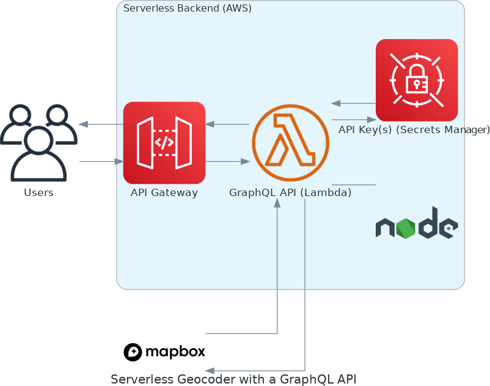

# Geocoder GraphQL API

This project is a simple GraphQL API for converting a physical address into geographic coordinates.  The project uses is a serverless architecture that is hosted on Amazon Web Services (AWS).
The following AWS services are used in the project:

* [Amazon API Gateway](https://aws.amazon.com/api-gateway/)
* [AWS Lambda](https://aws.amazon.com/lambda/)
* [AWS Secrets Manager](https://aws.amazon.com/secrets-manager/)

The [Mapbox Geocoding API](https://docs.mapbox.com/api/search/geocoding/) is used to convert address text to geographic coordinates.

## System Architecture

Here is the overall view of the system architecture:



## Prerequisites

### AWS Account

An AWS account is required to deploy this application.  The [AWS Command Line Interface (AWS CLI)](https://aws.amazon.com/cli/) is required to complete the developer setup steps. The AWS CLI must be configured and your credentials must have permissions to create infrastructure in the `us-east-1` region.

See [Getting started with the AWS CLI](https://docs.aws.amazon.com/cli/latest/userguide/cli-chap-getting-started.html) if you need to install or configure the AWS CLI.

### Mapbox API Access Token

The [Mapbox Geocoding API](https://docs.mapbox.com/api/search/geocoding/) provides the geocoding capability for the application.  For unit testing, you do not need a working Mapbox API key.  However, to successfully run the integration tests, you will need an API key.  To get a Mapbox API key, you have to have a Mapbox account.  You can [create a free account](https://account.mapbox.com/auth/signup/).  

#### Add the Mapbox API Key to the Local Environments File

After creating an account you should add the key to a file named `.env.local` in the root of the project folder.  You can create the local file manually or run the following command:

```bash
cp support/example.env.local .env.local
```

Then add your API key to `.env.local`.  `.env.local` is for storing the operating system environment variables during local development.

> the `.env.local` file should not be committed to the code repository.

#### Add the Mapbox API Key to Secrets Manager

For the live AWS environments, the Mapbox API key should be stored in [AWS Secrets Manager](https://aws.amazon.com/secrets-manager/).  Here is the command to store the API key in AWS Secrets Manager.

```bash
aws secretsmanager \
  create-secret --name GeocoderApiKeys \
  --secret-string '{"MAPBOX_API_KEY":"<replace with your Mapbox API key>"}' \
  --region us-east-1
```

All secrets stored in this service must have a unique name The default name for the secret used by the application is `GeocoderApiKeys`.

## Tech Stack

The project uses the following technologies and tools.

* Programming Languages: [TypeScript](https://www.typescriptlang.org/), [JavaScript](https://developer.mozilla.org/en-US/docs/Web/JavaScript), [BASH](https://www.gnu.org/software/bash/) shell
* Runtime: [NodeJS](https://nodejs.org/en/) v16
* Libraries and Tools:
  * [AWS CLI (aws)](https://aws.amazon.com/cli/) - The AWS Command Line Interface is a unified tool to manage your AWS services.
  * [AWS CDK (cdk)](https://aws.amazon.com/cdk/) - The AWS CDK lets you build reliable, scalable, cost-effective applications in the cloud with the considerable expressive power of a programming language.
  * [ESLint (eslint)](https://eslint.org) - ESLint is an open-source project that helps you find and fix problems with your JavaScript code.
  * [Mock Service Worker](https://mswjs.io/) - Mock Service Worker is an API mocking library that uses Service Worker API to intercept actual requests.
  * [pnpm](https://pnpm.io/) - Fast, disk space efficient package manager.
  * [Pothos GraphQL](https://pothos-graphql.dev/) - Pothos is a plugin-based GraphQL schema builder for typescript.
  * [AWS SAM CLI - sam](https://docs.aws.amazon.com/serverless-application-model/latest/developerguide/serverless-sam-cli-install.html) - AWS SAM provides you with a command line tool, the AWS SAM CLI, that makes it easy for you to create and manage serverless applications.
  * [Serverless Framework (SST) - sst](https://docs.sst.dev/) - SST is a framework that makes it easy to build full-stack serverless apps.
  * [Vitest](https://vitest.dev/) - Vitest is a blazing fast unit test framework powered by Vite.
