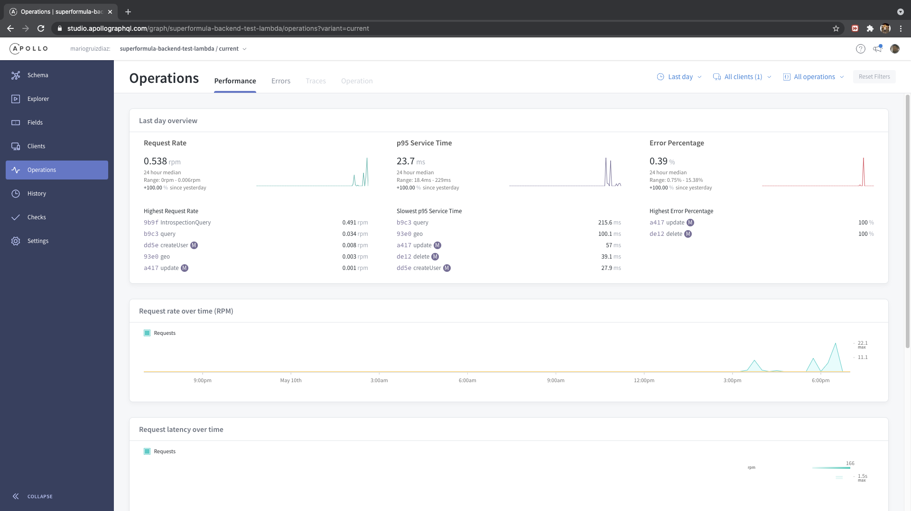
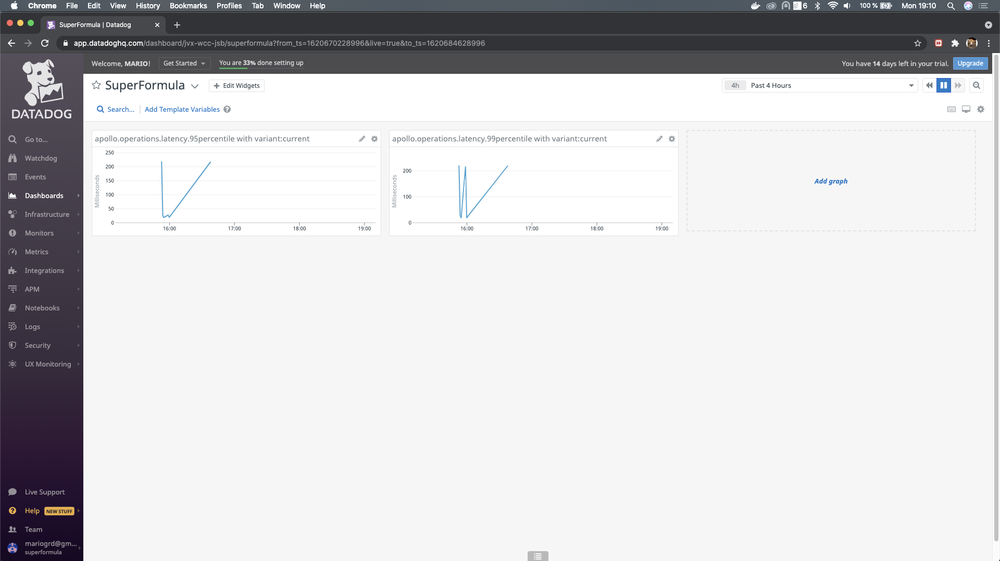

# Superformula Cloud Backend Test

## About


### Document Poursepose

The current document contains information related to developers that would like to run, test and even extend this project.

Having in consideration that the present proyect is the result of the Superformula hiring process, I sent the corresponding "Design & Architecrure" document to [Chloe Knapper](https://www.linkedin.com/in/chloeknapper/) by email. The document includes a dedicated sections to each requirement bullet in addition to a DEMO link. 

## Project description

GraphQL service based on Apollo Server v2 running in serverless mode. Specifically, the api runs as AWS lambda with a corresponding API Gateway, a Dynamodb as storage and an integration to Mapbox plaform.

The services provides CRUD oprations for the 'user' entity and a geocode query function to tranlate and direaction string into a geolocalized address.

## Design aspects

### Reusability

The crud services were developed in a generic way, to speed up the extension of this service by adding support for other models CRUDs operation without having the develop the identical resolvers over and over again.

For instance, to extend the service to support crud operation of a new model, the existing CRUDs services can be reused by copy and pasting the existing ones

| *Mutation/user.ts*
```js
  export const user = {
    async createUser(parent: any, args: any, context: { dataSources: { storage: StorageDataSource}}, info: any) {
      return await context.dataSources.storage.create(ModelEnum.user, args);
    },
  
    async updateUser(parent: any, args: any, context: { dataSources: { storage: StorageDataSource}}, info: any) {
      return await context.dataSources.storage.update(ModelEnum.user, args);
    },

    async deleteUser(parent: any, args: any, context: { dataSources: { storage: StorageDataSource}}, info: any) {
      return await context.dataSources.storage.delete(ModelEnum.user, args);
    },
  }
  ```

| *Query/user.ts* 

```js
  async users(parent: any, args: any, context: { dataSources: { storage: StorageDataSource}}, info: any) {
      return await context.dataSources.storage.read(ModelEnum.user, args);
    },
```

and changin "ModelEnum.user" by "ModelEnum.newModel"

### GraphQL Philosophy

One of the great purposes of GraphQL is to create endpoint to support as much as possible client apps UI use cases, without demanding them to receive all models attributes if some of those just need a few.

Following this concept, I built a query named "users' to support the following use cases:
- [x] User list (with and without paging)
- [x] Get one user by id
- [x] Get users by name (paging suport as well).


### Paging

The 'users' query returns an extra parameters named "lastEvaluatedKey". This parameter must by combined with the 'Limit' one to use paging functionality.
Receiving an non null value in "lastEvaluatedKey", means that there are more items matching to the executed serach query. This must be included on the following query execution to receive the next item list page.


## Prerequisites

* Development and local testing
    * Docker
    * Node.js environment (v14.x or above is preferred)
    * Mapbox account and access_token. [Mapbox](https://mapbox.com)
    * yarn
    * npm
    * npx
* Extras for deployments to AWS
    * aws developer account
    * aws cli


## Development

### Setup


- **Clone the repo**
- **Install dependencies**

  ```bash
  yarn install
  ```

- **Preparation for e2e testing and running the service locally**
  Dynamodb deployment in local docker environment

  ```bash
  npm run docker:local-db
  ```

  | *NOTE* Before running this command, ensure you have installed and running docker in your machine.

- **Unit Test**

  ```bash
  npm run test:unit
  ```
- **Integration Test**

  ```bash
  npm run test:integration
  ```

- **e2e Test**
  ```bash
  npm run test:e2e
  ```
  | *NOTE* There is an existing issue related to the background services after running the e2e are not killed properly. So, the work aroud, until the bug is fixed, will requires to kill it manually or restarting the machine. 


### Deployments

- **local**

  ```bash
  npm run local
  ```

- **Explorer and play with the service**

  The GraphQL Playgraound is enabled in non prod environment to lets you explore the schema and execute queries a mutations
  After executing "npm run local" you will be able to access to the Playgroind tool on http://localhost:3000/dev/playground

  | *NOTE* Add the following header attribute on the "HATTP HEADERS" secition of the Playgraoung tool . 
  ```js
      {
        "x-api-key": "super-formula-api-key-token"
      }
  ```

- **aws**

  - **aws cli setup**

    ```bash
    aws configure
    ```

    | *NOTE* Please configure your aws cli in this way only avoing to include the key in this proyect code.

  - **deploy**

    The following command will create and s3 in aws. package your and upload your service to it, create the api gateway and the Dynamdb database. This also connects these resources to aws cloudwatch monitoring service

    ```bash
    npm run deploy
    ```

    At the end of the process you will see the url for the api gateway that epxose this graphql lambda service. Remeber to add the header key

  - **destroy**
    ```bash
    npm run deploy
    ```

## Monitoring

### Aplollo Studio

The service can be monitored by Apollo Studio



You need to add the Apollo keys to the env varables in ./serverless.yml file

```javascript
  APOLLO_KEY: "[YOUR_KEY]"
  APOLLO_GRAPH_VARIANT: [YOUR_ENVIRONMENT]
  APOLLO_SCHEMA_REPORTING: true
```

| *NOTE* To obtaing a graph API key go [here](https://www.apollographql.com/docs/studio/setup-analytics/#pushing-traces-from-apollo-server).

### Datadog

You can send metrics to Datadog platform as well to monitor your service



| *NOTE* To know how to connect yout Apollo Dashboard to Datadog go [here](https://www.apollographql.com/docs/studio/datadog-integration/#gatsby-focus-wrapper).

## Miscellaneous
### Commands

- `npm run lint` Runs eslint
- `npm run test:unit` Execute the unit tests
- `npm run test:integration` Run the integration tests
- `npm run test:e2e` Run the e2e tests
- `npm run docker:local-db` Deploy the Dynamo db in the local docker
- `npm run local` Deploy the Dynamo db in the local docker and run the lambda locally
- `npm run deploy` Deploy the services to AWS
- `npm run destroy` Destroy the related services from AWS

## Pendings
- More scenarios for unit, integration and e2e tests
- Fix the problem of killing the childprocess after the e2e testing excution
- CI/CD by using git actions or circleCi
