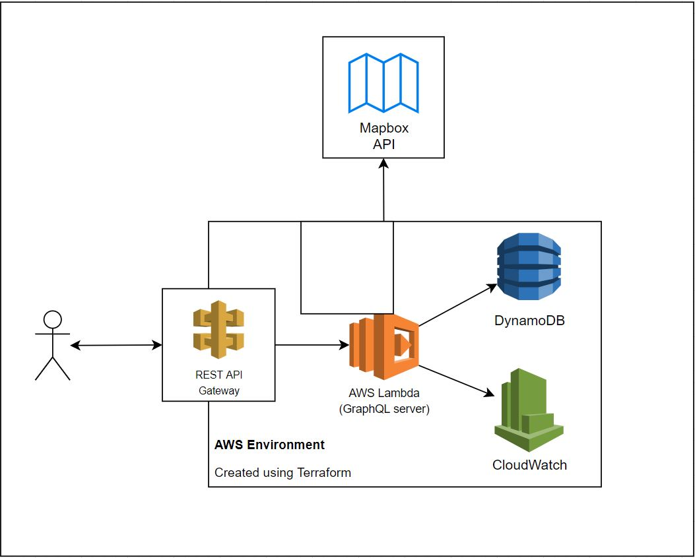

# Superformula Full Stack Developer Test - Fabio's Solution

This repository's project is a GraphQL AWS Lambda server that supports CRUD operations for a User schema, including listing with filtering and pagination, and also supports string address queries to obtain its geolocation. It also includes the [Terraform](https://www.terraform.io/) files used for resource creation and Lambda deployment in AWS environment. The solution is inside '[solution](./solution)' folder.

## Features

This solution supports the following features:

-   Create AWS resources
-   CRUD operations for the User
-   Listing Users with pagination and filtering by name
-   Obtain a list of possible geolocations from a string address

## Overview

The repository is composed of two main directories:

-   "infra": Terraform files to create resources on AWS
-   "server": The GraphQL server

A GitHub action was configured to run all unit tests on commits and only allow merge requests if all tests are passing.

## Infrasctructure

Using Terraform (version 3.30 because it's being already 2 months of testing), the following resources are created on AWS:

-   AWS Lambda: The GraphQL server is deployed as a Lambda function
-   API Gateway: REST API to serve requests to the GraphQL server
-   DynamoDB: The server's database

The [Mapbox](https://www.mapbox.com/) API Key must be provided on '[infra/lambda.tf](./solution/infra/lambda.tf)' file, on AWS Lambda environment variables, to authenticate.

### Insomnia testing setup

The Lambda is connected to the REST API Gateway, to serve the GraphQL server the incoming requests. [Insomnia](https://insomnia.rest/) was used for testing, the collection can be found [here](./assets/Insomnia_GraphQL_Fabio.json), import it to your Insomnia instance to simplify testing.

## Server

The starting setup was made using [Prettier](https://prettier.io/) and [ESLint](https://eslint.org/), they were configured to find and fix code problems according to the rules defined. I configured these tools using my personal preferences.

The GraphQL server was created using [TypeScript](https://www.typescriptlang.org/), it was one of the solution's requirement, and [Apollo Server Lambda](https://www.apollographql.com/docs/apollo-server/deployment/lambda/) because, after some time studying how to create a GraphQL API, I agree with Apollo Server creators that "It's the best way to build a production-ready, self-documenting GraphQL API that can use data from any source", and using the "[apollo-server-lambda](https://www.npmjs.com/package/apollo-server-lambda)" package makes it easy to deploy in the AWS environment. The library [GraphQL Code Generator](https://www.graphql-code-generator.com/) was used to generate types from schemas for TypeScript.

Here is the architecture:



[Mapbox](https://www.mapbox.com/) was the Geolocation API chosen for address queries, integrated with the solution using the [@mapbox/mapbox-sdk](https://www.npmjs.com/package/@mapbox/mapbox-sdk) package.

To create the artifact to be deployed on AWS, the [trace-pkg](https://github.com/FormidableLabs/trace-pkg) package was chosen and configured. It generates a .zip file that will be used by Terraform to create the Lambda.

The main schemas for this project are:

```graphql
type User {
    id: ID!
    name: String!
    dob: String
    address: Address
    description: String
    createdAt: String
    updatedAt: String
    imageUrl: String
}

type Address {
    place: String!
    latitude: Float!
    longitude: Float!
}
```

The User schema is composed of the required files on the test specs, just the address is a little bit different, it became an object with the address name and its geolocation info (latitude and longitude).

Dates are supported on DynamoDB, but I chose to store them as ISO strings using the [moment.js](https://momentjs.com/) library. The front end can easily parse these strings and manipulate the Date objects.

Since I chose to use DynamoDB for listing users and support filetering on pagination on it, I tried to use native functions to achieve it. I searched a lot on how to do it directly with DynamoDB and tried to bring the best practices found, even though I know there is a huge space for improvement.

The server uses CloudWatch for logging and currently has no alarms set. All exceptions occured on business logic are logged.

### Unit tests

All unit tests for the server business logic were made using [Jest](https://jestjs.io/) with the "ts-jest" package. To mock DynamoDB, "[jest-aws-sdk-mock](https://www.npmjs.com/package/jest-aws-sdk-mock)" was also used since it made it much simpler to deal with DynamoDB in the testing environment.

### GraphQL API Documentation

You can find the GraphQL Documentation [here](http://graphql-doc.s3-website-us-east-1.amazonaws.com). (Created manually to save time)

## Requirements

In order to build, deploy and/or test the project you need to install:

-   [Node.js](https://nodejs.org/en/)
-   [AWS CLI](https://aws.amazon.com/pt/cli/)
-   [Yarn](https://yarnpkg.com/getting-started/install)
-   [Terraform CLI](https://learn.hashicorp.com/tutorials/terraform/install-cli?in=terraform/aws-get-started)

## Unit tests

To run the project tests, navigate to the "server" folder and execute the following commands

```
yarn install
yarn test
```

All tests will be executed and a coverage report will be shown.

## Integration tests

It was not simple to set up an environment for integration tests, so I came up with the following approach: run the Lambda server and DynamoDB locally and execute the tests making calls to the API.

### Setup

To run the integration tests you must also install:

-   [Docker](https://www.docker.com/get-started)
-   [AWS SAM CLI](https://docs.aws.amazon.com/serverless-application-model/latest/developerguide/serverless-sam-cli-install.html)

Be sure your ports 8000 and 3000 are available and navigate to [solution/server](./solution/server) in your command line and execute the following commands to set up the environment:

```
docker run -d --name ddb -p 8000:8000 amazon/dynamodb-local
aws dynamodb create-table --cli-input-json file://tests/integration/setup/dynamodb-config.json --endpoint-url http://localhost:8000
aws dynamodb batch-write-item --request-items file://tests/integration/setup/UsersTable.json --endpoint-url http://localhost:8000
docker network create integration-tests-network
docker network connect integration-tests-network ddb
yarn build
```

The DynamoDB local should be running in background, now it's time to start the Lambda server. Navigate to [solution/server/tests/integration](./solution/server/tests/integration), update the [template.yaml](./solution/server/tests/integration/template.yaml) file with your Mapbox API Key (line 23) and execute the following commands inside integration folder:

```
sam build
sam local start-api --docker-network integration-tests-network
```

Now, the Lambda server will be running on http://localhost:3000.

### Test execution

Navigate to [solution/server](./solution/server) folder and execute the following command to run the tests:

```
yarn integ-test
```

These tests take a little to run, but the timeouts are configured to let them run.

### Cleanup resources

When done testing, clean up the resources created. Close the Lambda server and run the following commands to unmount Docker resources:

```
docker stop ddb
docker rm ddb
docker network rm integration-tests-network
```

These commands will stop DynamoDB local and remove the network created.

## Deploying

To deploy the server, a [configured AWS account](https://docs.aws.amazon.com/sdk-for-java/v1/developer-guide/setup-credentials.html) and a Mapbox API Key are needed. Replace the value of "MAPBOX_API_KEY" entry on Lambda AWS environment variables on [infra/lambda.tf](./solution/infra/lambda.tf) file.

First, it is necessary to build the project and create the artifact for deployment. Terraform is currently configured to deploy resources on region 'us-east-1', you may change it on file '[infra/main.tf](./solution/infra/main.tf)'.

Navigate to the server folder and execute on the command line:

```
yarn install
yarn build-package
```

The .zip file will be created in the artifacts folder (same level of the server folder). Now navigate to the infra folder and execute:

```
terraform init
terraform apply
```

Check if the resources listed are the ones you want and confirm the creation on Terraform.

The API Gateway outputs the URL of the API, append the path "/graphql" to it in order to make requests to the server.

### GraphQL Playground

The Playground is available in the URL received as output from API Gateway, you can use it to make queries to the server.

## Further improvements

-   E2E testing
-   Strategy for Lambda error handling, retries, and DLQs
-   Improve cloud-native logging, monitoring, and alarming strategy across all queries/mutations
-   Online interactive demo with a publicly accessible link to API
-   Commit linting
-   Semantic release
-   Improve logging
-   Add more test cases with different flows
-   Add authentication and authorization for requests
-   Add [schema checks](https://www.apollographql.com/docs/studio/schema-checks/) and connect to GitHub
-   Improve listing with filtering and pagination, maybe integrate DynamoDB with ElasticSearch
-   Fix warnings on package generation with trace-pkg
