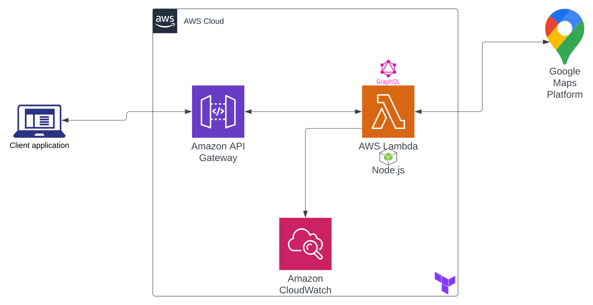

# Superformula Cloud Backend Test - Manan Habib

## Table of contents

- [Technical stack](#tech-stack)
- [Architecture](#arch)
- [Project Structure](#proj-struct)
- [Environment Variables](#env-vars)
- [Building and running](#build-run)
- [API Reference](#api-ref)
- [Implementation Details](#impl-details)
- [Demo](#demo)

<a name="tech-stack"></a>
## Technical stack

- [**Node.js**](https://nodejs.org/en/) as runtime
- [**Typescript**](https://www.typescriptlang.org/) as programming language
- [**API Gateway**](https://aws.amazon.com/api-gateway/) to expose API
- [**AWS Lambda**](https://docs.aws.amazon.com/lambda/latest/dg/welcome.html) as compute service
- [**AWS CloudWatch**](https://aws.amazon.com/cloudwatch) for logging 
- [**GraphQL**](https://graphql.org/) as specification to develop API using **Apollo Server**
- [**Terraform**](https://www.terraform.io/) as IaC

<a name="arch"></a>
## Architecture
As the image shows, we have serverless architecture of this project built upon amazon web services.
the first entry point for request is **Api Gateway** which redirects the request to corresponding lambda 
function. After gateway, **AWS Lambda**, gets the request and this is the actual component where request gets
processed and response is generated for user. It is the building block of serverless architecture where on each 
request a lambda gets triggered, serves the response and gets killed. While process of request in lambda, all the 
logs and traces being generated get saved in **AWS Cloudwatch service**.

To get the coordinates against given address, **Google geocoding api** is being used. Lambda function directly communicates
with this service to fetch the location data. 



<a name="proj-struct"></a>
## Project Structure
Following is the directories arrangememnt in folder:
```
.
├───coverage                # Code coverage report. Jest produce results in this folder.
├───iac                     # All the terraform files reside in this directory
│   ├───aws
│       ├───api_gateway     # Contains .terraform files for api gateway
│       └───lambda          # Contains tf files for aws lambda and its role
├───src
│   ├───configs             # Implementation around env files and global configs
│   ├───dataSources         # Apollo server data sources implementation to wire requests to services
│   ├───resolvers           # Graphql Query/Mutation resolvers implementation
│   │   └───coordinates
│   ├───schema              # Implementation around graphql schema
│   ├───services            # Contains services implementation which makes core business logic of app
│   └───utils               # Contains helper/reusable functions 
└───tests
    ├───e2e                 # Contains End to end tests
    └───unit                # Contains unit tests
        
```
<a name="env-vars"></a>
## Environment Variables
Following are the important environment variables to be set to run the application. For the scope of this project
I have added env files for dev, test and aws environments having variables set in it. (Although, env files shouldn't
be part of git repo and deployments variable should be in terraform.)
```
NODE_ENV             # Environment of the app
GOOGLE_MAPS_KEY      # Api key for maps api
LOG_LEVEL            # Log level of the application

```
<a name="build-run"></a>
## Building and running

#### Pre-Reqs
This project was developed on windows machine but a *package.linux.json* file is created for linux users. You just need to rename the file to *package.json* and delete or rename current one(which is for windows). Before building and running the project, you are supposed to install some 7zip cli tool and terraform. Use following commands to install 7zip:
```
sudo apt install p7zip-full
```
To install terraform use this [link](https://learn.hashicorp.com/tutorials/terraform/install-cli). After installing, initiate it using following command in project's root directory
```
terraform init
```

To manage the build and ship, some npm commands have been implemented in *package.json* file.
#### Install required packages
In order to install required packages, run following command in project root directory:
```
npm install
```
This will generate assets in *./build* folder.
#### Build
In order to build the project and generate assets for deployment, run:
```
npm run build
```
This will generate assets in *./build* folder.

#### Run tests
In order to run the test and generate coverage report:
```
npm test
```
This will generate CLI report as well as report assets in *./coverage* folder.

#### Run locally
In order to run the app locally, hit:
```
npm start
```
This will host application locally on default 4000 port.
#### Deploy to aws
In order to run the app locally, hit:
```
npm run aws-deploy
```
This command will automate the whole building and shipping process using the CLI. On running this, 
it will build the assets, run all the test suites, generate a coverage report, create the zipped dist package,
create/update the terraform plan and apply it to deploy it to aws. Upon successful deplpyment, you
shoudl be seeing lambda url in CLI output.

<a name="api-ref"></a>
## API Reference

#### Get location coordinates

``` Sample request
  curl -X POST \
  http://localhost:4000/ \
  -H 'cache-control: no-cache' \
  -H 'content-type: application/json' \
  -H 'postman-token: 3e3c3fa8-b827-3b61-ced1-8e3a12f229ca' \
  -d '{"query":"query                           {\n  getCoordinates(address: \"New York\"){\n    ... on Coordinates{\n      latitude\n      longitude\n    }\n    ... on Error{\n      code\n      message\n    }\n  }\n  \n    \n}\n\n\n","variables":{"address":null}}'
```

| Parameter | Type     | Description                |
| :-------- | :------- | :------------------------- |
| `address` | `NonEmptyString` | **Required**. Arbitrary address to know the coordinates of |

#### Response

```http
  {
    latitute: value,
    longitude: value
  }

  //in case of error

  {
    code: <errorCOde>
    message: <errorMessage>
  }
```
<a name="impl-details"></a>
## Implementation Details

- Most important aspect of implementation is that it isusing Graphql for API specification. Following are some details of how components are designed.
- **Schema**
    - Schema is defined in .graphql file turned into *typedefs* by reading the schema file on runtime.
    - A union of type `Coordinates` and `Error` is implemented to have clean error handling in business layer.
    - There's a custom type being implemented to have validation of non empty address on first level of request.
    **Note**: We could have add validation in business layer as well instead of implementing custom type but given the
    fact that app is serverless and cost would be based on compute time, its intutive if we reject the request on schema validation level rather
    than let it to go to business layer and have further compute. 
- **Resolvers**
    - Resolvers are organized on the basis of schema structure. Currently, resolvers just get the request and wire it don to data sources layer. No business logic is exposed in this layer.
- **Data Sources**
    - This is a simple layer which uses dependency container to resolve the service component and make it available for resolver layer to call.
- **Services**
    - Servcice layer is where all the business logic is implemented. Dependency container from `typedi` is being incorporated in this layer to make services implementation injectable and resolvable without hassle of managing the lifecycle of objects. Dependencies of each service class is also injected in DI container at start of app to be available to consume with in service. This makes whole solution extensible as well as testable.

<a name="demo"></a>
## Demo

Link to the demo video: [Video Link](https://youtu.be/pToCMUI9dq8)
Link to lambda function: [Lambda Link](https://5puw69eq20.execute-api.us-east-1.amazonaws.com/staging/graphql)
