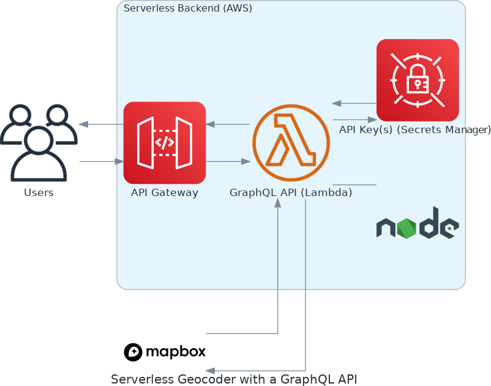

# Geocoder GraphQL API

This project is a simple GraphQL API for converting a physical address into geographic coordinates.  The project uses is a serverless architecture that is hosted on Amazon Web Services (AWS).
The following AWS services are used in the project:

* [Amazon API Gateway](https://aws.amazon.com/api-gateway/)
* [AWS Lambda](https://aws.amazon.com/lambda/)
* [AWS Secrets Manager](https://aws.amazon.com/secrets-manager/)

The [Mapbox Geocoding API](https://docs.mapbox.com/api/search/geocoding/) is used to convert address text to geographic coordinates.

## System Architecture

Here is the diagram for the system architecture:



## Prerequisites

### AWS Account

An AWS account is required to deploy this application.  The [AWS Command Line Interface (AWS CLI)](https://aws.amazon.com/cli/) is required to complete the developer setup steps. The AWS CLI must be configured and your credentials must have permissions to create infrastructure in the `us-east-1` region.

See [Getting started with the AWS CLI](https://docs.aws.amazon.com/cli/latest/userguide/cli-chap-getting-started.html) if you need to install or configure the AWS CLI.

### Mapbox API Access Token

The [Mapbox Geocoding API](https://docs.mapbox.com/api/search/geocoding/) provides the geocoding capability for the application.  For unit testing, you do not need a working Mapbox API key.  However, to successfully run the integration tests, you will need an API key.  To get a Mapbox API key, you have to have a Mapbox account.  You can [create a free account](https://account.mapbox.com/auth/signup/).  

#### Add the Mapbox API Key to the Local Environments File

After creating an account you should add the key to a file named `.env.local` in the root of the project folder.  You can create the local file manually or run the following command:

```bash
cp support/example.env.local .env.local
```

Then add your API key to `.env.local`.

> `.env.local` is for storing the operating system environment variables during local development and should not be committed to the code repository.

#### Add the Mapbox API Key to Secrets Manager

For the live AWS environments, the Mapbox API key should be stored in [AWS Secrets Manager](https://aws.amazon.com/secrets-manager/).  Here is the command to store the API key in AWS Secrets Manager.

```bash
aws secretsmanager \
  create-secret --name GeocoderApiKeys \
  --secret-string '{"MAPBOX_API_KEY":"<replace with your Mapbox API key>"}' \
  --region us-east-1
```

All secrets stored in this service must have a unique name. The default name for the secret used by the application is `GeocoderApiKeys`.

## Tech Stack

The project uses the following technologies and tools.

* Programming Languages: [TypeScript](https://www.typescriptlang.org/), [JavaScript](https://developer.mozilla.org/en-US/docs/Web/JavaScript), [Bash](https://www.gnu.org/software/bash/) shell
* Runtime: [NodeJS](https://nodejs.org/en/) v16
* Libraries and Tools:
  * [AWS CLI (aws)](https://aws.amazon.com/cli/) - The AWS Command Line Interface is a unified tool to manage your AWS services.
  * [AWS CDK (cdk)](https://aws.amazon.com/cdk/) - The AWS CDK lets you build reliable, scalable, cost-effective applications in the cloud with the considerable expressive power of a programming language.
  * [ESLint (eslint)](https://eslint.org) - ESLint is an open-source project that helps you find and fix problems with your JavaScript code.
  * [Mock Service Worker](https://mswjs.io/) - Mock Service Worker is an API mocking library that uses Service Worker API to intercept actual requests.
  * [pnpm](https://pnpm.io/) - Fast, disk space efficient package manager.
  * [Pothos GraphQL](https://pothos-graphql.dev/) - Pothos is a plugin-based GraphQL schema builder for typescript.
  * [AWS SAM CLI - sam](https://docs.aws.amazon.com/serverless-application-model/latest/developerguide/serverless-sam-cli-install.html) - AWS SAM provides you with a command line tool, the AWS SAM CLI, that makes it easy for you to create and manage serverless applications.
  * [Serverless Framework (SST) - sst](https://docs.sst.dev/) - SST is a framework that makes it easy to build full-stack serverless apps.
  * [Vitest](https://vitest.dev/) - Vitest is a blazing fast unit test framework powered by Vite.

### Infrastructre as Code (IAC)

#### Serverless Framework (SST) powered by AWS Cloud Development Kit (CDK)

[SST](https://docs.sst.dev/) is a collection of npm packages used to create serverless applications.   With SST, applications are defined with a combination of Infrastructure as Code (using CDK) and Lambda functions. Under the hood, SST uses CDK to compile the infrastructure into a CloudFormation template. These templates are then deployed as CloudFormation stacks.

These commands are examples of how to access the `cdk` CLI directly:

```bash
 npx sst cdk --app=build/run.js list
 npx sst cdk --app=build/run.js help
 ```

## Project Structure

Here is the folder structure of the project:

```text
cloud-backend-test
├─ __tests__
│  └─ assets
├─ graphql
├─ services
│  ├─ core
│  └─ functions
│     └─ graphql
├─ stacks
├─ support
├─ .env
├─ .env.local
├─ .eslintrc
├─ cdk.context.json
├─ sst.json
├─ setupTests.ts
└─ vitest.config.ts
```

### `__tests__/assets`

The data files in this folder are used as input or mocked results for testing.

### `stacks/`

The `stacks/` directory contains the app's infrastructure as defined in code. Or what is known as [Infrastructure as Code](https://serverless-stack.com/chapters/what-is-infrastructure-as-code.html) (IaC). SST by default uses TypeScript to define your infrastructure.

- `index.ts` defines all the stacks in the app.
- `Api.ts` creates the API with a GraphQL endpoint at `/graphql` using [API Gateway](https://aws.amazon.com/api-gateway/).
- `Api.spec.ts` defines the unit tests for infrastructure in `Api.ts`.

### `graphql/`

The `graphql/` directory contains the outputs of GraphQL-related code generation.

### `services/`

The `services/` directory houses everything that powers the backend. This includes the GraphQL API and business logic, other functions.

- `services/core` contains all of your business logic.

- `services/functions` the location of the code for the Lambda function.

- `services/functions/graphql` is a predefined function and the supporting code that serves up a GraphQL API. It is wired up for code-generation and connected to an API construct defined in `stacks`.

### `support/`

The contains scripts to help developers working on the project.

### `cdk.context.json`

`cdk.context.json` contains a dictionary of parameters used as input to the CDK stacks.  The secret name for the API keys is stored in this file.

### `sst.json`

`sst.json` contains the project config.

```json title="sst.json"
{
  "name": "cloud-backend-test",
  "region": "us-east-1",
  "main": "stacks/index.ts"
}
```

### `setupTests.ts`

`setupTests.ts` contains the configuration for the HTTP mocking and Mock Service Workers.

### `vitest.config.ts`

`vitest.config.ts` the configuration file for Vitest testing library.

## Developer Setup

### Environment Variables

The environments variables used by the Lambda function are:

| Name                    | Description        | Default Value |
| ----------------------- | ------------------ | ------------- |
| **MAPBOX_ACCESS_TOKEN** | the Mapbox API key | 
| **GEOCODER_API_KEYS_SECRETS_NAME** | the name of the secret for the API key (optional)  | GeocoderApiKeys |

> Do not store the value for `MAPBOX_ACCESS_TOKEN` in the code repository.  Use the AWS Secrets Manager service instead.

### Manual Dependency Check

> These commands are available as a `bash` shell script.

Run these commands to verify you have all the required command line tools installed:

```bash
node --version  # node version 16 is installed
npm --version   # npm is installed
sam --version   # sam is installed
docker ps -a    # docker is installed and running
aws --version   # aws is installed
```

### Automated Dependency Check

Run this script to automate the dependency checks:

```bash
./support/check-setup-dependencies.sh
```

### Manual Setup and Checks

> These commands are available as a `bash` shell script.

> When you see the following message enter `dev` as the stage. _"Look like you’re running sst for the first time in this directory. Please enter a stage name you’d like to use locally. Or hit enter to use the one based on your AWS credentials:"_

Run these commands to setup the project:

```bash
npm install -g pnpm                            # install pnpm
pnpm install                                   # install the project dependencies
pnpm run build --stage dev --region us-east-1  # compile the project
pnpm run coverage                              # run the unit tests
```

To invoke the Lambda function locally:

```bash
sam local invoke apiLambdaPOSTgraphql9D0A1996 --event ./__tests__/assets/event.json -t ./.build/cdk.out/dev-cloud-backend-test-Api.template.json
```

To invoke the Lambda function with an HTTP API:

```bash
sam local start-api -t ./.build/cdk.out/dev-cloud-backend-test-Api.template.json
```

```bash
curl --header "Content-Type: application/json" \
  --request POST \
  --data '{"query": "query { coordinate(address: \"New York City, New York, USA\") { \n... on QueryCoordinateSuccess { \n__typename \ndata {\nlatitude\nlongitude\n}\n}\n... on Error {\n__typename\nmessage\n}\n} }"}' \
  http://127.0.0.1:3000/graphql
```

To invoke the Lambda function with the AWS CLI:

```bash
sam local start-lambda -t ./.build/cdk.out/dev-cloud-backend-test-Api.template.json
```

```bash
aws lambda invoke --function-name "apiLambdaPOSTgraphql9D0A1996" --payload file://__tests__/assets/event.json --endpoint-url "http://127.0.0.1:3001" --no-verify-ssl --no-verify-ssl /dev/null
```

> Invoking the Lambda function makes calls to the Mapbox API.

### Automated Setup and Checks

> When you see the following message enter `dev` as the stage. _"Look like you’re running sst for the first time in this directory. Please enter a stage name you’d like to use locally. Or hit enter to use the one based on your AWS credentials:"_

Run this script to automate the setup and invoke the Lamba function locally:

```bash
./support/setup.sh
```

### Project Commands

Commands available via "pnpm run":

```bash
# build the default stage (dev)
pnpm run build

# deploy default stage (dev)
pnpm run deploy

# unit tests
pnpm run test

# unit tests with coverage report
pnpm run coverage

# starts unit test ui
pnpm run test:ui

# code lint
pnpm run lint

# code lint with fixes
pnpm run lint:fix
```

### Build Commands

> Prefix commands with `AWS_PROFILE=default` to specific a different profile.

#### Build Development Environment

Run this command to build the development environment:

```bash
pnpm run build
```

> prepend `--stage dev` to the command to build a specific stage.

#### Build Production Environment

Run this command to build the production environment:

```bash
pnpm run build --stage prod
```

### Deployment Commands

#### Deploy to Live Development Environment

Run this command to deploy the project to the live development environment:

```bash
# deploy the default stage (dev)
pnpm run deploy
```

> prepend `--stage dev` to the command to deploy a specific stage.

#### Deploy to Live Production Environment

Run this command to deploy the project to the live production environment:

```bash
# deploy the prod stage
pnpm run deploy --stage prod
```

## The GraphQL Schema

```graphql
type Coordinate {
  latitude: Float!
  longitude: Float!
}

type Error {
  message: String!
}

type Query {
  coordinate(address: String!): QueryCoordinateResult!
}

union QueryCoordinateResult = Error | QueryCoordinateSuccess

type QueryCoordinateSuccess {
  data: Coordinate!
}
```

### Sample Client Code for GraphQL API Queries

A ReactJS example.

```typescript
import { useQuery } from 'urql';

const coordinateQuery = `
  query Coordinate($address: String!) {
    coordinate(address: $address) {
      ... on QueryCoordinateSuccess {
        __typename
        data {
          latitude
          longitude
        }
      }
      ... on Error {
        __typename
        message
      }
    }
  }
`;

const [{ fetching, data, error }] = useQuery({
  query: coordinateQuery,
  variables: { address }
});
```

Example successful response:

```json
{
  "data": {
    "coordinate": {
      "__typename": "QueryCoordinateSuccess",
      "data": {
        "latitude": 40.740281,
        "longitude": -73.994801,
        "__typename": "Coordinate"
      }
    }
  }
}
```

Example error response:

```json
{
  "data": {
    "coordinate": {
      "__typename": "Error",
      "message": "Geocode not found"
    }
  }
}
```

## Monitoring and Tracing

The Lamba functions use the Tracing plugin for Pothos to add tracing and logging for the resolver invocations.  There is also a [Pothos plugin](https://pothos-graphql.dev/docs/plugins/tracing#aws-xray) for AWS XRay.

Some sample logs:

```log
2022-08-11T18:08:04.414Z        378a993b-ee10-4130-a749-2a696bde1ef9    INFO            Resolver of "Query.coordinate" done in 227.847562ms
2022-08-11T18:08:04.417Z        378a993b-ee10-4130-a749-2a696bde1ef9    INFO            Resolver of "QueryCoordinateSuccess.data" done in 0.140066ms
2022-08-11T18:08:04.417Z        378a993b-ee10-4130-a749-2a696bde1ef9    INFO            Resolver of "Coordinate.latitude" done in 0.210565ms
2022-08-11T18:08:04.418Z        378a993b-ee10-4130-a749-2a696bde1ef9    INFO            Resolver of "Coordinate.longitude" done in 0.323826ms
```
