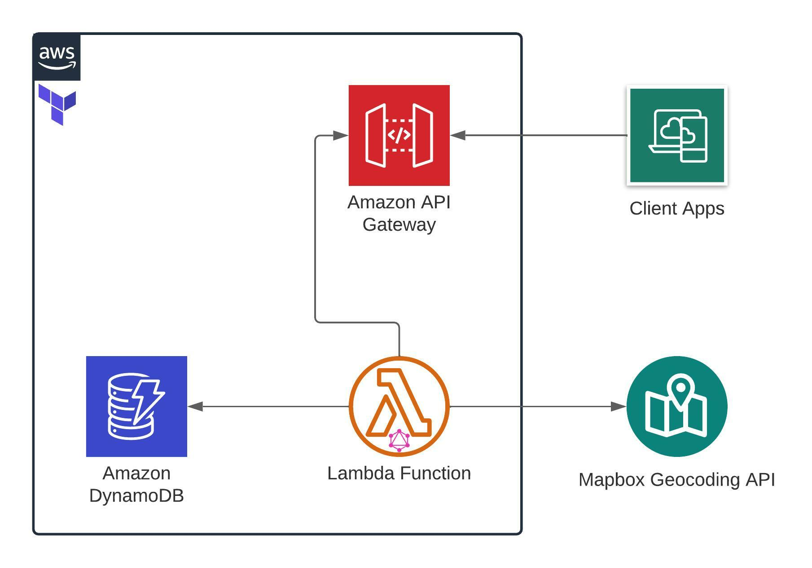

# Superformula Cloud Backend Test - Rodrigo Guadalupe

## Tech Stack
- Typescript
- Terraform
- AWS Lambda + API Gateway
- DynamoDB
- Mapbox Geocoding API

## Architecture
The following diagram shows an overview of the solutions architechture on a AWS environment: 



Here we have a labmda function running a GraphQL server using [Apollo Server Lambda](https://www.npmjs.com/package/apollo-server-lambda). This lambda function provides the required queries and mutations for CRUD operations of Users. To achieve that, the lambda function access an amazon DynamoDB database to read/write users.

The lambda function also access an external API service to fetch geolocation information with address queries. This solution uses [Mapbox Geocoding API](https://docs.mapbox.com/api/search/geocoding/) with the [@mapbox/mapbox-sdk
](https://www.npmjs.com/package/@mapbox/mapbox-sdk) package. 

Finally, client apps can execute GraphQL requests through the Amazon API Gateway.
## Project Structure
The project structure is organized in the following directories: 
```
.
├── terraform     # Terraform configuration files for deployment
├── server        # Users lambda function
    ├── src       # Source files of the solution
    └── test      # Tests for solution services
├── .gitignore
└── README.md
```

## Environment Variables
The project has 3 main environment variables: 
```
USER_TABLE_NAME  # Name of the users table on dynamoDB (default: 'Users')
ENVIRONMENT      # Environment of the deployment (default: 'dev')
MAPBOX_API_KEY   # Api key to access Mapbox API
```

## Execution
Here we could find guides to test, build and deploy the users lambda solution.
### Run tests
In order to run the project unit tests, we first need to go to `server` directory.
```sh
cd server
```
Then, we need to install the project's dependencies.
```sh
yarn install 
# or
npm install
```
Finally, to execute the unit test we run:
```sh
yarn test
# or
npm test
```
### Build package
In order to generate a deployment ready package, we first need to go to `server` directory.
```sh
cd server
```
Then, we need to install the project's dependencies.
```sh
yarn install 
# or
npm install
```
Finally, to create the package run the following command:
```sh
yarn build-pack
# or
npm build-pack
```
This will first execute the following steps: 
 - Run project's tests
 - Create a Typescript build
 - Copy the GraphQL schema file to `dist` folder using [copyfiles](https://www.npmjs.com/package/copyfiles) package
 - Create a zip package using [trace-pkg](https://www.npmjs.com/package/trace-pkg) packager into a `packages` folder on root.  
## Deployment
Before starting the deployment process: 
 - Make sure that you have already generated a deployment package ([see package building guide](#build-package)).
 - You need a configured AWS account ([guide with AWS cli](https://docs.aws.amazon.com/cli/latest/userguide/cli-configure-files.html)).
 - You need a Mapbox API key ([create mapbox account](https://docs.mapbox.com/api/overview/))

For deployment, we will use [Terraform](https://www.terraform.io/) to create all services inside AWS.

First, we need to go to `terraform` directory.
```sh
cd terraform
```
There, we need to run the following command to init terraform: 
```sh
terraform init
```
This solution uses 4 terraform variables declared inside [variables.tf](./terraform/variables.tf)
```
aws_region        # The region to use on AWS services (default: 'us-east-1')
environment       # The environment of the deployment (default: 'dev')
user_table_name   # The name of the table to be created on DynamoDB (default: 'Users')
mapbox_api_key    # The api key for Mapbox API.
```
To set the mapbox_api_key variable and modify any of the variables we can: 
 
 - Create a `terraform.tfvars` inside `terraform` folder including the variables: 

    ```
    mapbox_api_key = "pk.secret"
    environment    = "dev"
    ```

- Set the variables using `-var="mapbox_api_key = pk.secret"` option on `apply` command.

Finally, to deploy run:
```
terraform apply
```
After the execution, the `base_url` will be shown on CLI as an output: 
```sh
Outputs:

base_url = "https://tv6lwcwj2e.execute-api.us-east-1.amazonaws.com/dev"
```
## API Consumer Experience 

A ready-to-use playground of the solution can be found [here](https://tv6lwcwj2e.execute-api.us-east-1.amazonaws.com/dev).

Documentation of schema, queries and mutations can also be found inside the playground.