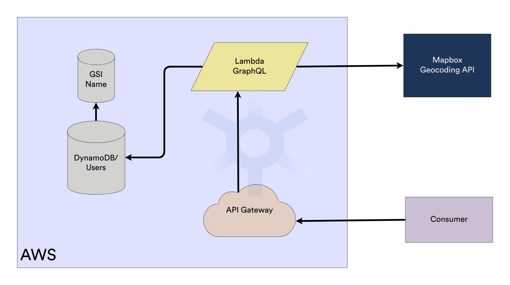

# Superformula Full Stack Developer Test

This repository contains an implementation for Superformula's cloud backend test. The following sections will describe the architecture and technologies used to fulfill the provided requirements.

## Overview



The above diagram shows a high-level view of the implemented architecture.

GraphQL requests reach an AWS API Gateway that triggers a Lambda Function responsible for handling the requests. Depending on the requested resource the Lambda will access either a DynamoDB table, called "Users", or Mapbox's geocoding API. To better implement some of the requests, the lambda function might access a Global Secondary Index created on the user's name attribute.

## Lambda Function

The lambda function was implemented using NodeJS and Typescript. It uses Apollo Server (more specifically, the [apollo-server-lambda](https://www.npmjs.com/package/@landingexp/apollo-server-lambda) npm package) to handle GraphQL requests.

Calls to DynamoDB are performed using DocumentClient from AWS SDK for NodeJS.

Application integration with Mapbox APIs was achieved with the [@mapbox/mapbox-sdk](https://www.npmjs.com/package/@mapbox/mapbox-sdk) npm package

## DynamoDB

The application depends on a DynamoDB Table to store its users. The users are stored using the following model:

```
{
    id: string;
	name: string;
	dob: string;
	address: string;
	description?: string;
	createdAt: string;
	updatedAt?: string;
}
```

The partition key for the table is the "id" attribute and no sort key was specified. To avoid table scans on the DynamoDB table, a Global Secondary Index was created using the "name" attribute as its partition key, this approach is not ideal and will be further discussed in the "Considerations" section.

## Mapbox Geocoding API

The application makes use of Mapbox forward geocoding API.

## Project structure

The project is divided into the following subfolders:

- /src - contains the source code for the lambda function.
- /terraform - contains the terraform files used in the deployment of the solution

Each of these folders has a README.md file detailing their structure and implementation.

## Deployment Instructions

To deploy the application, you will need to have a Mapbox access token, you can obtain it by accessing the https://account.mapbox.com/access-tokens/ while signed in to your Mapbox account. You'll also need a configured AWS account with the correct credentials to create the resources.

1. Navigate to ./src folder and run: `npm run pack`
2. Navigate to ./terraform folder and run: `terraform init`
3. Configure the terraform `mapbox_access_token` variable with your Mapbox access token, this can be done using one of the several methods provided by Terraform, as described in https://www.terraform.io/docs/language/values/variables.html.

   Tip: .tfvars files were added to the .gitignore file of the terraform folder (as specified on the default .gitignore for terraform, provided by github). You can create a file to assign your access token to the variable without risking accidentally commiting it to the source control.

4. Run: `terraform apply`
5. Your application should be set to go, an output should be provided with the base_url of your API gateway.

## Prototyping against the API

As mentioned above a GraphQL Playground was embedded into the application, you can access it by following the Deployment section.

Also, an Insomnia collection is provided on the insomnia.json file in this folder.

## Logging and Monitoring

A simple logging mechanism was implemented using Apollo plugins. By hooking to the `didEncounterErrors` event, error details were logged to CloudWatch.
The current implementation uses a console.error to output the error details, future implementations should use a logging library with better capabilities.

Also, the correct permissions were given to the Lambda function in order for it to correctly connect to CloudWatch, this enables all the base monitoring functions of CloudWatch.

## Achieved Requirements

### Tech stack

- Used Typescript
- Used Infrastructure-as-code tooling that can be used to deploy all resources to an AWS account - Used Terraform
- Used AWS Lambda + API Gateway
- Used DynamoDB.
- Location query used Mapbox API to obtain coordinate based on an address.

### Developer Experience

- Unit tests are written for business logic. (refer to [src/README.md](./src/README.md))
- Documentation provided in this file, on [src/README.md](./src/README.md), and on [terraform/README.md](./terraform/README.md).

### API Consumer Experience

- GraphQL documentation provided in [src/README.md](./src/README.md) and in GraphQL playground
- All operations required by the mockups and description provided.
  - User list with a parameter for filtering results
  - User detail query (by id) implemented
  - Geolocation query implemented. A free-text search parameter can be passed and the coordinates are returned based on it.

### Bonus

- Code coverage reports can be generated. The process is described on [src/README.md](./src/README.md) file
- Integration tests implemented
- Monitoring and logging using CloudWatch
- Lambda package generation using [trace-pkg](https://www.npmjs.com/package/trace-pkg) packager. This package performs tree shaking before packaging to achieve smaller package sizes.
- Playground can be used as described on [src/README.md](./src/README.md)

## Considerations

The current architecture's user list query by a search term uses a secondary index on the users table to find a user with a given name. This approach is not ideal for some reasons:

- It only enables querying for exact matches: DynamoDB can only query a partition key using exact matches. It can scan the whole table but this operation would be very costly.
- Using user's names as partition keys might lead to the hot partition issue. Which would reduce database throughput.

To improve the current architecture, we would probably want to use our DynamoDB table as a source for a search engine such as ElasticSearch. This not only would prevent the above problems but would also provide a richer user experience when querying the users by a search term. we could search for other fields besides the name, such as the address, the description, and so on.

## Next Steps

- Add E2E
- More integration tests - some integration tests were implemented but more are needed for a better coverage.
- Improve user search API: Use Elastic Search, as mentioned above
- Improve Logging.
- Add GraphQL documentation Generation
- Commit linting and semantic versioning
- Upload user image - Right now the application is returning a random picture from [Lorem Picsum](https://picsum.photos/), on a URL based on their IDs, we probably want to create a upload endpoint so that the users can upload their pictures.
